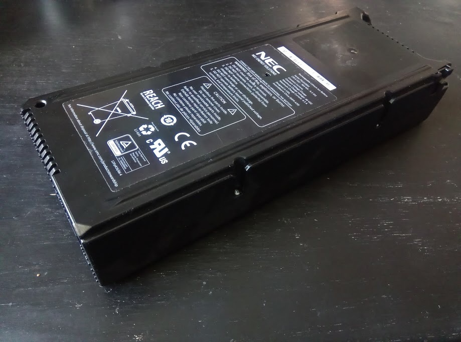
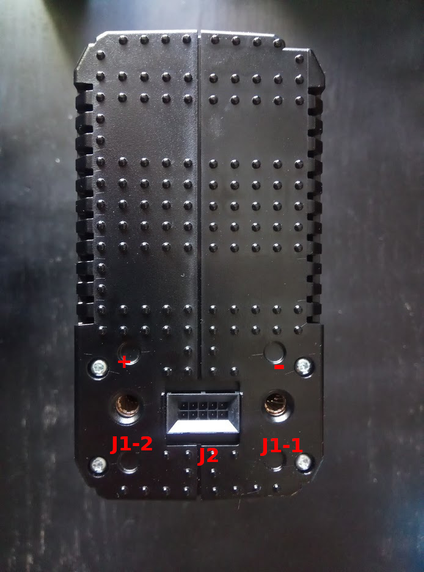

## Background

The NEC PSL010001 is a 364 Wh battery containing a 12S4P configuration of A123 ANR26650M1-B LiFePo4 cells. This battery is also sold under part number 078-000-110-00 for use within a standby power module (EMC 078-000-080) in EMC VMAX storage arrays.

In 2020, hundreds of used modules became available at a very low price point. However, although the battery module will accept a charge, discharging the battery requires communication with the module's BMS. Details on the communication scheme are not generally known.

## Goal

This repository aims to collect documentation about the module's BMS, with the overarching goal of learning how to communicate with it, enable discharge and retrieve module health information.

## Component identification

### External connectors

| Reference | Part # | Description |
| --- | --- | --- |
| J1-1 | Amphenol RADSOK PGY 5.7mm | Battery negative terminal |
| J1-2 | Amphenol RADSOK PGY 5.7mm | Battery positive terminal |
| J2 | Molex Micro-Fit 3 BMI 0444281001 | Communication interface |
